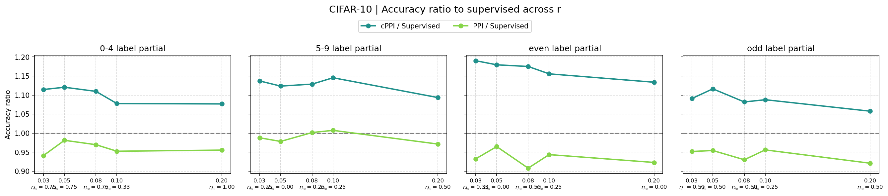
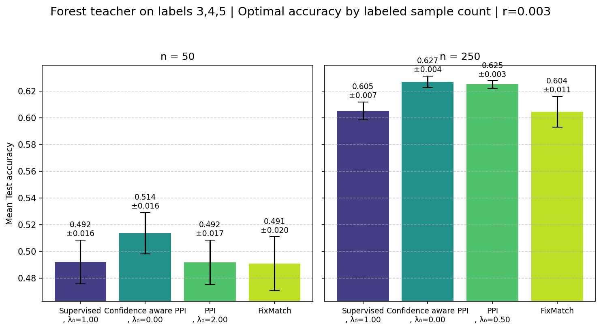
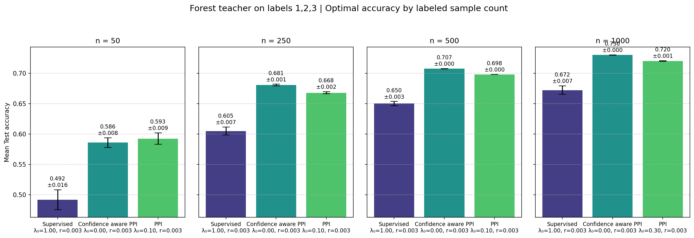

# CMPP_rebuttal

### CIFAR10

*Figure 1. Accuracy relative to supervised learning across labeled-to-unlabeled sample ratios.*
Accuracy ratio relative to supervised learning across labeled-to-unlabeled ratios 
\( r = \frac{n}{N-n} \). Values above 1 indicate improvement. 
Each subplot corresponds to a different partial-label teacher. The x-axis also reports the ratio 
of optimal interpolation weights \( r_{\lambda_0} = \lambda_0^{\text{cPPI}} / \lambda_0^{\text{PPI}} \), 
where \( \lambda_0 = 1 - \lambda \).
CPP consistently outperforms supervised learning, while PPI often does not, especially at low \( r \).

---

### Covertype

*Figure 2. Accuracy performance across SSL methods under partial-label forest teachers.*
Test accuracy vs. labeled sample count \( n \) for supervised, PPI, CPP, and FixMatch under a partial-label forest teacher. Each method is evaluated at its optimal \( \lambda_0 \). Error bars show standard deviation. CPP consistently outperforms baselines, especially for small \( n \).

*Figure 3. Accuracy performance over labeld sample count under partial-label forest teachers.*
 Accuracy performance over labeled sample count \( n \in \{50, 250, 500, 1000\} \) under a partial-label forest teacher (labels 1–3). We compare supervised learning, PPI, and confidence-aware PPI (CPP), each evaluated at its optimal interpolation parameter (shown below each bar). 

All methods improve, but CPP maintains an advantage, indicating robustness to limited supervision and effective use of pseudo-labels.
